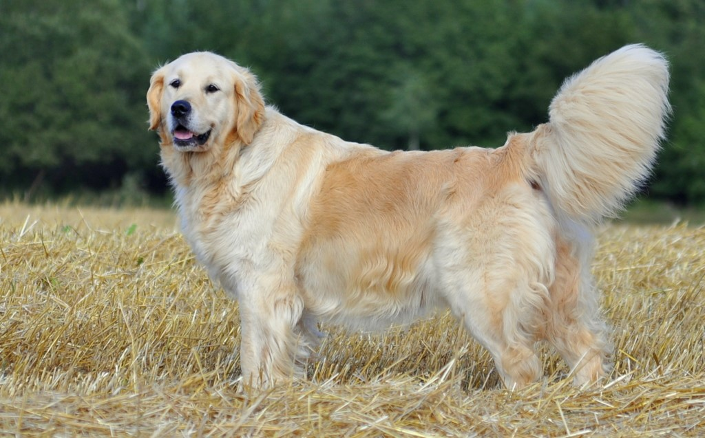

# My own account's README

I love code things 
<picture><source media="(prefers-color-scheme: dark)" srcset="./blob_SRC/code.webp" width="300px"></picture>
 and dogs 
<picture><source media="(prefers-color-scheme: dark)" srcset="./blob_SRC/retro.jpg" width="300px"></picture>
.

## 
<picture><source media="(prefers-color-scheme: dark)" srcset="./blob_SRC/me.png" width="90px"></picture>
 About me 
I love code. I code with my dad that have a account on GitHub 
<picture><source media="(prefers-color-scheme: dark)" srcset="./blob_SRC/view.png" width="40px"></picture>
[See he account](https://github.com/arsenii10). I want that my projects have good quality. I have a friend named Mateo, it's my favourite friend 
<picture><source media="(prefers-color-scheme: dark)" srcset="./blob_SRC/me.png" width="90px"></picture>
.

