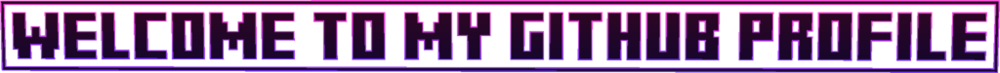

# El archivo README de mi cuenta

Me encantan las cosas de código 
<picture><source media="(prefers-color-scheme: dark)" srcset="./code.webp" width="300px"></picture>
 y los perros 
<picture><source media="(prefers-color-scheme: dark)" srcset="./retro.jpg" width="300px"></picture>
.

## 
<picture><source media="(prefers-color-scheme: dark)" srcset="./me.png" width="90px"></picture>
 Sobre mí
Me encanta programar. Programo con mi papá, quien tiene una cuenta en GitHub. 
<picture><source media="(prefers-color-scheme: dark)" srcset="./view.png" width="40px"></picture>
[Ver la cuenta](https://github.com/arsenii10). Quiero que mis proyectos sean de buena calidad. Tengo un amigo que se llama Mateo, es mi amigo favorito. 
<picture><source media="(prefers-color-scheme: dark)" srcset="./me.png" width="90px"></picture>
.

  <picture>
    <source media="(prefers-color-scheme: dark)" srcset="./planet.svg" width="20px">
    
  </picture>

Cambiar de idioma:
Idiomas dentro: [ENG](https://github.com/nico1monte/nico1monte/blob/main/README.md) | ESP